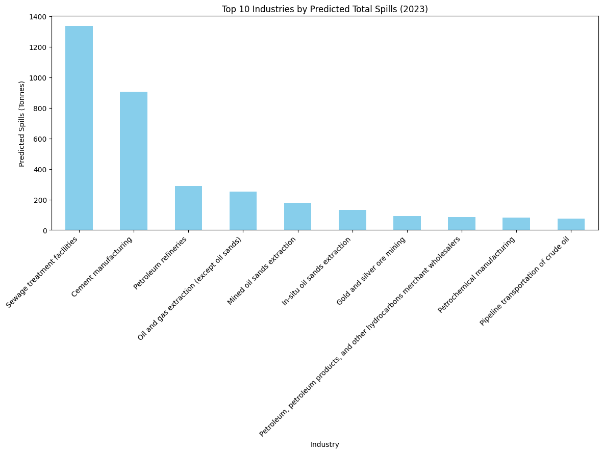

# 🌍 NPRI Analysis: Phase 1 & 2

## Overview

This project dives into data from the **National Pollutant Release Inventory (NPRI)** (2000–2022) to uncover patterns, trends, and factors affecting pollutant releases across Canada. Using data science techniques, we explored, cleaned, and modeled the data to provide meaningful insights into environmental impact. 🌱

---

## What We Did 🛠️

### 🕵️‍♂️ Data Exploration
- Examined the dataset for trends and patterns.
- Highlighted temporal changes and geographical hotspots for pollutant emissions.

### 🎨 Visualizations
- Created interactive and static charts to visualize pollutant trends.
- Mapped geospatial distributions of emissions across Canada.

### 🛠️ Data Cleaning & Preprocessing
- Fixed duplicates, missing values, and outliers.
- Normalized and transformed features to improve data consistency.

### 🤖 Machine Learning
- Built predictive models to analyze pollutant release trends.
- Evaluated model performance using metrics like MSE and R².

---

## Results 📊

### Key Insight
A prediction of total spills across industries in 2023 revealed the top contributors to pollutant releases. The chart below summarizes the findings:

**Highlights:**
- **Sewage treatment facilities** and **cement manufacturing** are projected to be the largest contributors.
- Industries like petroleum refining and oil extraction are also significant, indicating areas for targeted environmental intervention.

---

## Deliverables 📂
- **Jupyter Notebook**: Contains all the analysis and modeling steps.
- **Presentation (PPT)**: Summarizes findings and key insights with visuals.

---

## Tools & Libraries 🛠️
- `pandas`, `numpy` for data manipulation.
- `matplotlib`, `seaborn` for visualization.
- `geopandas` for geospatial analysis.
- `scikit-learn` for machine learning.
